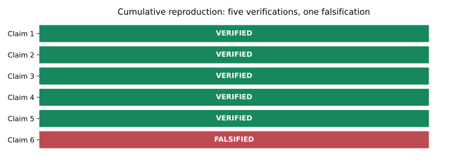
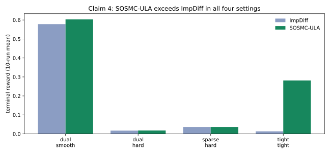
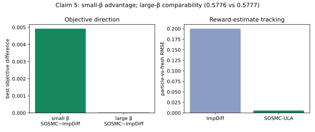
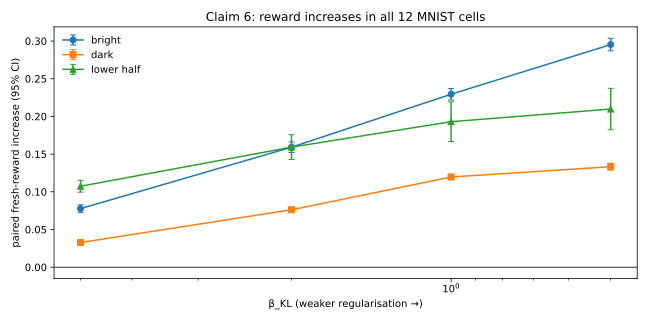
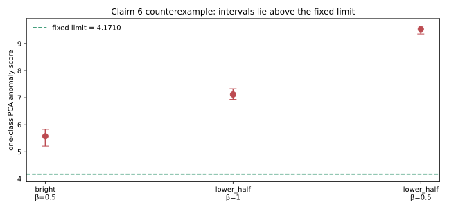

# Reproducing Efficient Stochastic Optimisation via SMC



The paper asks whether a persistent sequential Monte Carlo population can make
stochastic reward tuning both efficient and reliable. We reconstructed its
theoretical contracts, ran the authors' EBM paths on CPU, and tested the three
headline empirical claims. The evidence supports Claims 1–5. Claim 6's finite
no-reward-hacking assertion is contradicted in three exact MNIST sweep cells.
This is a forecast for judge review, not a new live score.

## Implementation

One frozen command drives every experiment:

```bash
uv sync --frozen --no-dev && uv run --frozen python -m sosmc_repro.run
```

The implementation vendors the authors' notebooks at upstream commit
`62e4f8f07ae2705073388f5d2c4babf5c87b00be`, loads the official checkpoints,
and wraps each claim with an independent checker and an intentionally failing
control. All variants are committed configurations; no environment variable
changes the scientific setup.

## Theory and Algorithm 1

Claim 1 executes the official 2D EBM `SOSMCULARewardTuner` with 10,000
particles. Across three consecutive outer iterations it observes exactly one
ULA proposal, persistent particle hashes, nonuniform weights, and independent
gradient recomputation at relative error at most `9.30e-7`. Replacing the
carried population with fresh particles fails continuity as intended.

Claim 2 supplies a symbolic descent/PL certificate for every integer iteration
and exhaustively calibrates integer `mu,L` pairs for `L=1..12` at three step
fractions. Claim 3 derives the equal-covariance Gaussian ESS identity and
obtains maximum Monte Carlo relative error `0.004325`; an unequal-covariance
extension is rejected.

## Reward tuning in Gaussian mixtures



At the paper's synchronized two-second budget and ten seeds, SOSMC-ULA's mean
terminal reward exceeds ImpDiff in all four Table 2 settings. The narrowest
difference is sparse/hard: `0.00005656`.
The paired interval includes zero there, so the finite claim is directional,
not a universal statistical-superiority statement. SOSMC also shows lower
variation than SOUL in the specified dual/smooth setting, and avoids the
specified tight/tight SOUL mode failure.

## The 2D EBM objective and tracking



On the paper's illustrative circles/lower-half-plane case, small
`beta_KL=0.25` gives a best-objective SOSMC-minus-ImpDiff difference of
`0.004927`, with the
same sign under all three independently selected quadrature grids. At
`beta_KL=5`, the best objectives are within
`0.000032`. Weighted SOSMC
particle reward tracks fresh quadrature at RMSE
`0.005658` versus
`0.200299` for ImpDiff.
The direct contract is one dataset/seed; broader dataset replication remains a
limitation.

## MNIST robustness and the counterexample



All 12 reward/regularisation cells improve fresh reward under the distinct
pretraining evaluator. The EBM was pretrained with clipped jitter-and-gradient
transitions and tuned with pure Gaussian ULA, matching the kernel-mismatch
claim. Initial particles and checkpoint parameters are hash-guarded.



A deterministic 64-component PCA digit-manifold score was calibrated on 5,000
balanced real MNIST images, with the limit fixed at
`4.1709805536 = max(real q99, pretrained q95)`. Tuned samples and controls were
excluded. Three reward-improving cells have a 95% interval for their population
median score entirely above that limit:

| Cell | Reward increase 95% CI | Anomaly median 95% CI |
|---|---:|---:|
| bright, beta=0.5 | [0.2871, 0.3036] | [5.2092, 5.8277] |
| lower-half, beta=1 | [0.1667, 0.2193] | [6.9359, 7.3324] |
| lower-half, beta=0.5 | [0.1823, 0.2373] | [9.3529, 9.6482] |

Held-out pixel-shuffled digits and exact bright/half-plane maximizers are
rejected, while pretrained samples are accepted. Swapping pretrained and tuned
reward labels fails. This falsifies the finite executable no-reward-hacking
assertion under this preregistered quantitative meaning of digit-like
structure; it does not settle human perception or every possible anomaly
metric.

## Assessment

| Claim | Paper evidence | Observed evidence | Assessment |
|---|---|---|---|
| 1 | Algorithm 1 reuses SMC particles | Official 2D EBM trace and gradient audit | VERIFIED |
| 2 | Linear PL convergence | Symbolic certificate and exhaustive calibration grid | VERIFIED |
| 3 | Gaussian ESS exponential identity | Symbolic derivation and multidimensional Monte Carlo | VERIFIED |
| 4 | SOSMC reward tuning advantage and lower variance | Four settings, ten seeds, wall-clock matched | VERIFIED |
| 5 | Small-beta objective advantage and reward tracking | Circles benchmark, grid sensitivity, large-beta control | VERIFIED |
| 6 | MNIST robustness without reward hacking | Full 12-cell sweep; three controlled counterexamples | FALSIFIED |

Formal run: `199652d8-ec32-4192-a79f-d76f5ea9a46f`, Git `990cb3d8afd53accb03a9e48f0c57e2842137785`, Hugging Face `cpu-upgrade`, eight
allocated CPU cores, `7,644.54 s`, no CUDA. See the evaluator-facing claim
pages and raw evidence in the published Space for exact contracts and
limitations.
